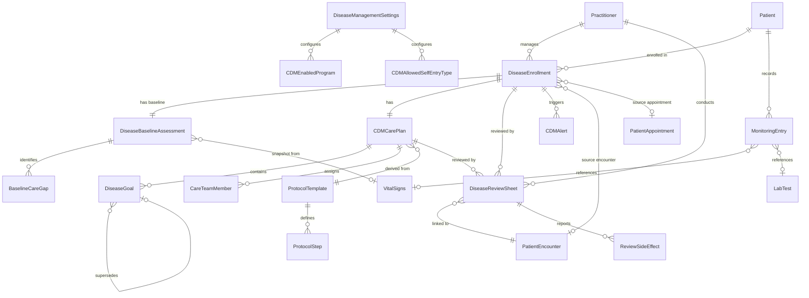

# Domain Model

## Entity Relationship Overview

## Configuration Entities (Implemented in Story 1)

| Entity | Module | Description |
|---|---|---|
| Disease Management Settings | CDM Shared | Single doctype — global configuration for review intervals, alert thresholds, protocol toggles, and portal settings |
| CDM Enabled Program | CDM Shared | Child table of Settings — which disease programs are active |
| CDM Allowed Self Entry Type | CDM Shared | Child table of Settings — monitoring entry types patients can self-report |

## Core Entities -- Implemented

| Entity | Module | Story | Description |
|---|---|---|---|
| Disease Enrollment | CDM Enrollment | 4 | Links a Patient to a disease program with status lifecycle (Draft/Active/On Hold/Completed/Withdrawn) |
| Disease Baseline Assessment | CDM Enrollment | 6 | Point-in-time clinical baseline linked 1:1 to enrollment; snapshots vitals, labs, medications |
| Baseline Care Gap | CDM Enrollment | 6 | Child table of baseline: missing items identified during assessment |
| CDM Care Plan | CDM Care Plans | 7 | Individualized care plan with goals, care team, and timeline linked to enrollment |
| Care Team Member | CDM Care Plans | 7 | Child table of care plan: multi-disciplinary team assignments |
| Disease Goal | CDM Care Plans | 7 | Linked doctype: measurable clinical goal with revision-based versioning |
| Disease Review Sheet | CDM Reviews | 8 | Structured clinical review linked to Patient Encounter with multi-section data capture |
| Review Side Effect | CDM Reviews | 8 | Child table of review sheet: medication side effect tracking |

## Core Entities -- Planned

| Entity | Module | Description |
|---|---|---|
| Monitoring Entry | CDM Monitoring | Patient-submitted or device-captured data point |
| CDM Alert | CDM Monitoring | Threshold-breach or compliance alert |
| Protocol Template | CDM Protocols | Evidence-based template for a disease type |
| Protocol Step | CDM Protocols | Child table: ordered step within a protocol |

## Reused Entities (Existing DocTypes -- extended via Custom Fields)

| Entity | Source App | How CDM Uses It |
|---|---|---|
| Patient | Healthcare | Link field target; Custom Fields for enrollment flags |
| Patient Encounter | Healthcare | Reviews are linked to encounters; CDM context panel shows disease data |
| Vital Signs | Healthcare | Monitoring entries reference vitals; encounter context panel shows latest |
| Lab Test | Healthcare | Monitoring entries reference lab results; encounter context panel shows HbA1c/FBS |
| Lab Test Template | Healthcare | Protocol steps reference expected tests |
| Patient Appointment | Healthcare | Reviews may generate appointments |
| Healthcare Practitioner | Healthcare | Care plan, care team, and review ownership |
| Medication Request | Healthcare | Medication snapshot via adapter layer |
| Drug Prescription | Healthcare | Encounter-level prescription data via adapter |

## Constants and Enums

All domain constants are centralized in `alcura_diabetes_obesity_disease_mgmt/constants/`:

| Module | Enums / Constants |
|---|---|
| `disease_types.py` | `DiseaseType` (Diabetes, Obesity, Combined Metabolic, Prediabetes / Metabolic Risk) |
| `statuses.py` | `EnrollmentStatus`, `CarePlanStatus`, `ReviewStatus`, `GoalStatus`, `AlertSeverity`, `AlertStatus`, `ProtocolStatus` |
| `clinical.py` | `ReviewType`, `GoalType`, `GoalMetric`, `CareTeamRole`, `DiseaseReviewType`, `ScreeningType`, `MonitoringEntryType`, `AdherenceStatus`, `CareGapStatus`, `AppetiteResponse`, `SatietyResponse`, `WeightResponse`, `SideEffectSeverity`, `SideEffectAction`, `HypoglycemiaSeverity`, state transition maps |
| `lab_markers.py` | `DiabetesMarker`, `ObesityMarker`, `MetabolicMarker`, disease-specific marker lists |
| `roles.py` | `ALL_CDM_ROLES`, `CLINICIAN_ROLES`, individual role name constants |

## Status Lifecycles

### Enrollment
`Draft` -> `Active` -> `On Hold` | `Completed` | `Withdrawn`

### Care Plan
`Draft` -> `Active` -> `Under Review` -> `Active` | `Completed` | `Cancelled`

### Goal
`Not Started` -> `In Progress` -> `Achieved` | `Partially Met` | `Not Met` | `Revised`

### Review
`Draft` -> `In Progress` -> `Completed` | `Rescheduled`
`Scheduled` -> `In Progress` | `Missed` -> `Rescheduled`

### Alert
`Open` -> `Acknowledged` -> `Resolved` | `Dismissed`

## State Transition Validation

State transitions are enforced programmatically via `alcura_diabetes_obesity_disease_mgmt.utils.validators`:

- `validate_enrollment_status_transition(current, target)`
- `validate_care_plan_status_transition(current, target)`
- `validate_review_status_transition(current, target)`

Transition maps are defined in `constants/clinical.py` as dictionaries mapping each status to its list of allowed next statuses. Terminal states (Completed, Withdrawn, Cancelled, Revised, Achieved) have empty transition lists.

## Goal Versioning

Disease Goals use revision-based versioning via a self-referential `supersedes` link field:
- When revising, the current goal is marked "Revised" (terminal)
- A new goal is created with `supersedes` pointing to the old goal
- The `version` counter increments
- Full revision history is traversable via `CarePlanService.get_goal_history()`
