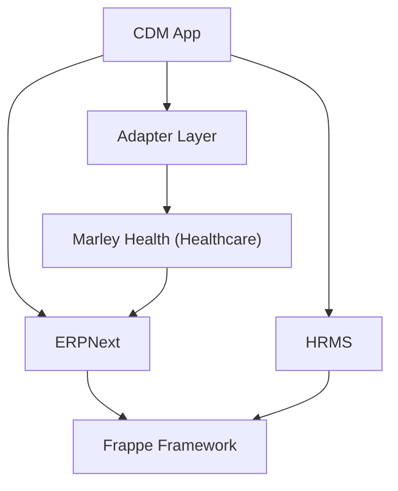

# Integration Points

## Overview

The CDM app integrates with existing Frappe, ERPNext, and Marley Health doctypes through several mechanisms. This document catalogs each integration point.

## Integration Mechanisms

### 1. Healthcare Adapter Layer (Story 2)

All read access to Healthcare doctypes is routed through the adapter layer (`alcura_diabetes_obesity_disease_mgmt/adapters/`). See [ADR-004](../decisions/ADR-004-healthcare-adapter-layer.md) and [reused-doctype-mapping.md](reused-doctype-mapping.md) for details.

| Adapter Module | Healthcare DocType(s) | Key Methods |
|---|---|---|
| `patient_adapter` | Patient | `get_patient_summary`, `get_patient_risk_factors`, `search_patients` |
| `encounter_adapter` | Patient Encounter | `get_latest_encounter`, `get_encounter_history`, `get_encounter_prescriptions` |
| `vitals_adapter` | Vital Signs | `get_latest_vitals`, `get_vitals_history`, `get_vitals_trend`, `get_bmi_history` |
| `lab_adapter` | Lab Test, Lab Test Template | `get_latest_lab_result`, `get_relevant_labs`, `get_lab_trend` |
| `medication_adapter` | Medication Request, Drug Prescription | `get_current_medications`, `get_medication_snapshot` |
| `appointment_adapter` | Patient Appointment | `get_upcoming_appointments`, `get_appointment_history` |
| `practitioner_adapter` | Healthcare Practitioner | `get_practitioner_info`, `get_practitioners_for_department` |

### 2. Custom Fields on Existing DocTypes (Story 4)

Custom Fields are added during `after_install` and exported via the `fixtures` hook. They extend existing doctypes without modifying source code.

| Target DocType | Field(s) | Purpose |
|---|---|---|
| Patient | `cdm_section_break` (Section Break) | CDM section header |
| Patient | `cdm_enrolled` (Check, Read Only) | Flag indicating the patient has an active CDM enrollment |
| Patient | `cdm_active_programs` (Small Text, Read Only) | Comma-separated list of active disease programs |

Defined in `alcura_diabetes_obesity_disease_mgmt/setup/custom_fields.py`.

### 3. OPD Enrollment Triggers (Story 5)

Client-side scripts inject "Enroll in Disease Program" buttons into Healthcare doctype forms:

| DocType | Script File | Pre-fill Context |
|---|---|---|
| Patient | `public/js/patient.js` | patient, patient_name, patient_sex, patient_age |
| Patient Encounter | `public/js/patient_encounter.js` | + practitioner, source_encounter |
| Patient Appointment | `public/js/patient_appointment.js` | + practitioner, source_appointment |

Registered via `doctype_js` in `hooks.py`. See [enrollment-from-opd.md](../flows/enrollment-from-opd.md).

### 4. Baseline Prefill via Adapters (Story 6)

The `BaselineService` uses the adapter layer to auto-populate baseline assessments:

| Adapter | Data Pulled | Baseline Fields |
|---|---|---|
| `vitals_adapter` | Latest vital signs | height, weight, BP, pulse |
| `lab_adapter` | Disease-relevant lab results | Lab source date |
| `medication_adapter` | Active medications + encounter prescriptions | Formatted medication snapshot |

See [baseline-prefill-flow.md](../flows/baseline-prefill-flow.md).

### 5. Encounter Disease Context Panel (Story 9)

The Patient Encounter form is extended with a CDM context panel that shows chronic disease data at-a-glance during OPD visits.

| Component | Purpose |
|---|---|
| `services/encounter_context.py` | Aggregates enrollment, care plan, goals, vitals, labs, medications, care gaps, trends |
| `api/encounter_context.py` | Whitelisted endpoint `get_disease_context(patient, encounter)` |
| `public/js/patient_encounter.js` | Renders panel in encounter dashboard section with action buttons |

The panel loads via a single API call on form refresh and only renders when the patient has an active CDM enrollment. See [encounter-disease-panel.md](../flows/encounter-disease-panel.md).

### 6. Disease Review from Encounter (Story 8)

A "Disease Review" button in the Patient Encounter form creates or navigates to a Disease Review Sheet linked to the encounter. See [review-from-encounter.md](../flows/review-from-encounter.md).

### 7. Document Event Hooks (`doc_events`) -- Planned

Hooks in `hooks.py` will listen to lifecycle events on existing doctypes:

| DocType | Event | Purpose |
|---|---|---|
| Patient | validate | Sync CDM enrollment flags |
| Patient Encounter | on_submit | Auto-update linked Disease Review Sheet status |
| Vital Signs | on_submit | Create/update CDM Monitoring Entry, check alert thresholds |
| Lab Test | on_submit | Create/update CDM Monitoring Entry, check protocol compliance |

### 6. Dashboard Overrides

The CDM app extends the Patient dashboard to show CDM-specific cards (active enrollment, care plan summary, upcoming reviews).

### 8. Linked DocType References

CDM custom doctypes use standard Frappe `Link` fields to reference existing doctypes:

- `Disease Enrollment.patient` -> Patient
- `Disease Enrollment.practitioner` -> Healthcare Practitioner
- `Disease Enrollment.source_encounter` -> Patient Encounter
- `Disease Enrollment.source_appointment` -> Patient Appointment
- `Disease Enrollment.primary_clinic` -> Healthcare Service Unit
- `Disease Baseline Assessment.enrollment` -> Disease Enrollment
- `Disease Baseline Assessment.patient` -> Patient
- `Disease Baseline Assessment.vitals_source` -> Vital Signs
- `CDM Care Plan.enrollment` -> Disease Enrollment
- `CDM Care Plan.patient` -> Patient
- `CDM Care Plan.practitioner` -> Healthcare Practitioner
- `Disease Goal.care_plan` -> CDM Care Plan
- `Disease Goal.patient` -> Patient
- `Disease Goal.supersedes` -> Disease Goal (self-referential)
- `Disease Review Sheet.patient` -> Patient
- `Disease Review Sheet.enrollment` -> Disease Enrollment
- `Disease Review Sheet.care_plan` -> CDM Care Plan
- `Disease Review Sheet.encounter` -> Patient Encounter
- `Disease Review Sheet.practitioner` -> Healthcare Practitioner
- `Monitoring Entry.vital_signs` -> Vital Signs
- `Monitoring Entry.lab_test` -> Lab Test

### 9. Scheduled Tasks

Background jobs check for overdue reviews, monitoring threshold breaches, and protocol compliance on configurable schedules.

### 10. Portal Integration

The patient portal extends Marley Health's portal with CDM-specific pages (care plan view, self-monitoring submission, progress charts).

## Compatibility Guards

The adapter layer includes built-in compatibility checks:

- `require_doctype(name)` — raises `CDMDependencyError` if a required doctype is missing
- `optional_doctype(name)` — returns False with a warning if an optional doctype is missing
- `field_exists(doctype, field)` — checks for specific field availability
- Install hook `_verify_healthcare_compatibility()` logs warnings for missing expected doctypes

## Dependency Map

