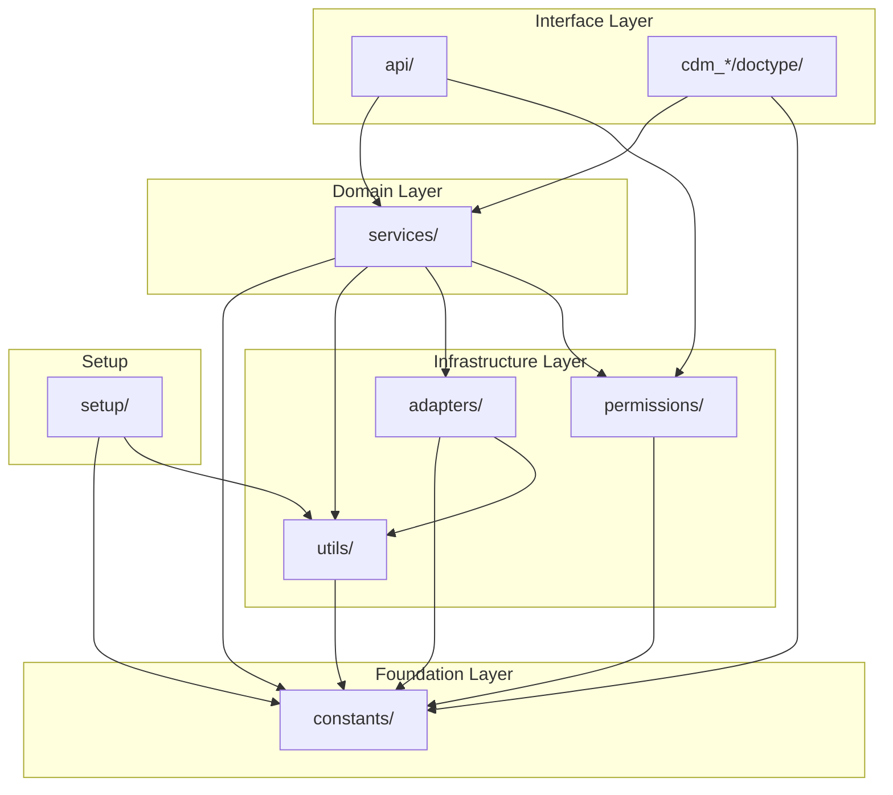

# Module Dependency Map

## Overview

This document shows how the internal modules of the CDM app depend on each other. Understanding these dependencies helps developers know which modules are foundational (change carefully) vs. which are leaf modules (safe to modify in isolation).

## Dependency Diagram

## Layer Descriptions

### Foundation Layer (`constants/`)

Zero internal dependencies. Defines all enums, status maps, role names, lab markers, and string constants. Every other module may import from here.

| Module | Contents |
|---|---|
| `constants/disease_types.py` | `DiseaseType` enum, `SUPPORTED_DISEASE_TYPES` |
| `constants/statuses.py` | `EnrollmentStatus`, `CarePlanStatus`, `ReviewStatus`, `GoalStatus`, `AlertSeverity`, `AlertStatus`, `ProtocolStatus` |
| `constants/clinical.py` | `ReviewType`, `GoalType`, `ScreeningType`, `MonitoringEntryType`, `AdherenceStatus`, `CareGapStatus`, state transition maps |
| `constants/lab_markers.py` | Disease-specific lab marker constants |
| `constants/roles.py` | Role name constants |

### Infrastructure Layer

#### `utils/`

Depends only on `constants/`. Provides:
- `date_utils.py` — review scheduling, period boundaries, overdue checks
- `formatters.py` — clinical value display formatting
- `validators.py` — status transition validation, disease type validation
- `document_helpers.py` — safe document CRUD, settings accessor, patient/program lookups

#### `adapters/`

Depends on `constants/` and `utils/`. Provides read-only access to existing Healthcare doctypes (Patient, Encounter, Vital Signs, Lab Test, etc.) through a stable abstraction layer. Includes compatibility guards for schema differences across environments.

#### `permissions/`

Depends on `constants/`. Provides:
- `cdm_permissions.py` — query conditions, portal isolation, role checks
- `role_matrix.py` — programmatic permission definitions
- `audit.py` — status change and critical action logging

### Domain Layer (`services/`)

Depends on `constants/`, `utils/`, `adapters/`, and `permissions/`. Contains business logic separated from doctype controllers:
- `enrollment.py` — enrollment lifecycle
- `care_plan.py` — care plan CRUD and goal management
- `protocol.py` — protocol application and compliance
- `monitoring.py` — monitoring entries and threshold evaluation
- `review.py` — review scheduling and completion
- `alert.py` — alert creation, acknowledgement, resolution
- `dashboard.py` — aggregation for dashboards

### Interface Layer

#### `api/`

Depends on `services/` and `permissions/`. Whitelisted API endpoints that delegate to services.

#### `cdm_*/doctype/`

Frappe doctype controllers. Depend on `services/` and `constants/`. Keep controllers thin — delegate to services.

### Setup Layer (`setup/`)

Depends on `constants/` and `utils/`. Handles installation, role creation, custom field setup, and demo data seeding.

## Import Rules

1. **No circular imports**: Lower layers never import from higher layers.
2. **Constants are universal**: Any module may import from `constants/`.
3. **Services are the domain boundary**: API endpoints and doctype controllers call services, never adapters directly.
4. **Adapters are internal**: Only `services/` should call `adapters/`. Do not call adapters from API endpoints or doctype controllers.
