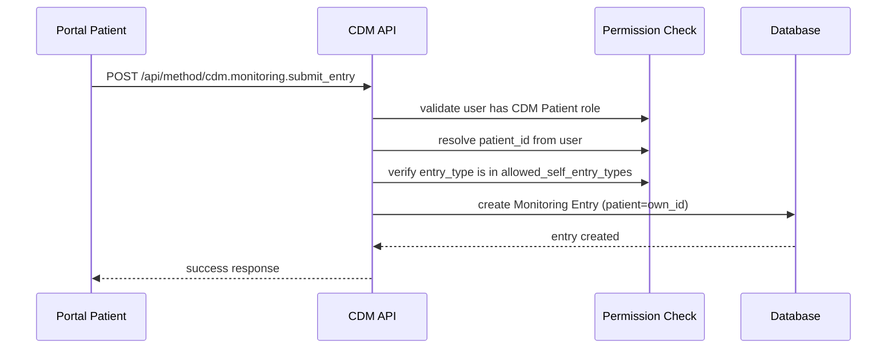

# Portal Access Model

## Overview

CDM Patient portal users can view their own clinical data and submit self-monitoring entries. This document describes how portal access is isolated and secured.

## Portal User Resolution

When a patient registers as a portal user, Marley Health links their User record to a Patient record via the `user_id` field on the Patient doctype.

The CDM app resolves this linkage using:

```python
from chronic_disease_management.permissions.cdm_permissions import get_patient_for_user

patient_id = get_patient_for_user()  # returns "PAT-001" or None
```

This function:
1. Checks if the current user is not Administrator or Guest.
2. Looks up `Patient.user_id` matching the session user.
3. Returns the Patient name or `None`.

## Access Rules

### What Portal Patients Can See

| DocType | Access | Constraint |
|---|---|---|
| Disease Enrollment | Read | Own patient only |
| CDM Care Plan | Read | Own patient only (if `show_care_plan_to_patient` is enabled in settings) |
| Periodic Review | Read | Own patient only |
| Monitoring Entry | Read + Create | Own patient only |
| CDM Alert | Read | Own patient only |

### What Portal Patients Cannot Do

- View other patients' records (enforced by query conditions and document-level checks).
- Modify enrollments, care plans, reviews, or alerts.
- Access Protocol Templates or Protocol Steps.
- Access Disease Management Settings.
- Export data.

## Enforcement Layers

### Layer 1: DocType Permissions

The CDM Patient role has `read: 1` (and `create: 1` for Monitoring Entry only) in the role matrix. Frappe's standard permission engine enforces this.

### Layer 2: Permission Query Conditions

`get_cdm_query_conditions()` appends a WHERE clause to all list queries:

```sql
-- For portal patient PAT-001:
WHERE `tabDisease Enrollment`.`patient` = 'PAT-001'
```

This prevents list views from leaking other patients' data.

### Layer 3: Document-Level Permission

`has_cdm_permission()` checks individual document access:

```python
if doc.patient != patient_id_for_user:
    return False  # denied
```

This prevents direct URL access to documents belonging to other patients.

### Layer 4: API Endpoint Validation

Whitelisted portal API endpoints call `validate_portal_access(doc)` before returning data:

```python
@frappe.whitelist(allow_guest=False)
def get_my_care_plan():
    # ... fetch care plan ...
    validate_portal_access(care_plan)  # raises PermissionError if not owned
    return care_plan
```

## Self-Monitoring Entry Flow



## Settings Controls

The Disease Management Settings doctype provides portal-specific toggles:

| Setting | Effect |
|---|---|
| `enable_patient_portal` | Master toggle for all portal features |
| `allow_self_monitoring_entry` | Enable/disable patient self-monitoring |
| `allowed_self_entry_types` | Whitelist of entry types patients can submit |
| `show_care_plan_to_patient` | Show/hide care plan in portal |
| `show_lab_results_to_patient` | Show/hide lab results in portal |

## Security Considerations

1. **No client-side trust**: All access control is enforced server-side. Client-side filtering is for UX only.
2. **Escaped SQL**: `get_cdm_query_conditions()` uses `frappe.db.escape()` for all user-provided values.
3. **No cross-patient queries**: Even if a patient knows another patient's ID, they cannot query or access their records.
4. **Audit trail**: Self-monitoring entries record the `source` as "Patient" for traceability.
5. **Rate limiting**: Portal API endpoints should implement rate limiting (future enhancement).
