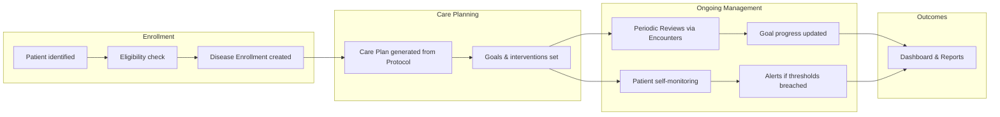

# Solution Overview

## Purpose

The Chronic Disease Management (CDM) app provides longitudinal management of **Diabetes**, **Obesity**, and **Combined Metabolic Conditions** within the Frappe/ERPNext healthcare ecosystem. It is built as an extension layer over Marley Health (Frappe Healthcare), not as a standalone system.

## Architecture Principle: Extension Over Fork

```
+-------------------------------------------------------------+
|                     CDM App (this app)                       |
|  Enrollment | Care Plans | Reviews | Monitoring | Protocols |
+-------------------------------------------------------------+
        |              |             |            |
        v              v             v            v
+-------------------------------------------------------------+
|              Marley Health (Healthcare App)                  |
|  Patient | Encounter | Vital Signs | Lab Test | Appointment |
+-------------------------------------------------------------+
        |              |             |
        v              v             v
+-------------------------------------------------------------+
|              ERPNext 16  |  HRMS 16  |  Frappe 16           |
+-------------------------------------------------------------+
```

The CDM app:

- **Extends** existing doctypes via Custom Fields and doc_events hooks
- **Links to** existing doctypes (Patient, Practitioner, Patient Encounter, Vital Signs, Lab Test, Patient Appointment) via Link fields
- **Creates new doctypes** only for domain concepts without existing representation (e.g., Disease Enrollment, CDM Care Plan, Protocol Template, Goal, Alert)
- **Never modifies** core Frappe, ERPNext, or Marley Health source files

## Module Map

| Module | Responsibility |
|---|---|
| CDM Enrollment | Enrolling patients into disease programs, eligibility checks, enrollment lifecycle |
| CDM Care Plans | Individualized care plans with goals, interventions, and medication references |
| CDM Reviews | Scheduled periodic reviews linked to Patient Encounters |
| CDM Monitoring | Patient self-monitoring, vitals ingestion, threshold-based alerts |
| CDM Dashboards | Clinician dashboards, program overviews, population health views |
| CDM Reports | Script reports, query reports, analytics for clinical and administrative use |
| CDM Patient Portal | Patient-facing portal for self-service, progress tracking, appointment booking |
| CDM Protocols | Evidence-based protocol templates, compliance tracking |
| CDM Integrations | External system connectors, data exchange |
| CDM Shared | Cross-cutting child tables, shared utilities, common lookups |

## Data Flow



## Key Technical Decisions

- See [ADR-001: Reuse-First Healthcare Architecture](../decisions/ADR-001-reuse-first-healthcare-architecture.md)
- See [ADR-002: Custom DocType Strategy](../decisions/ADR-002-custom-doctype-strategy.md)
- See [ADR-003: Portal Security Boundaries](../decisions/ADR-003-portal-security-boundaries.md)
