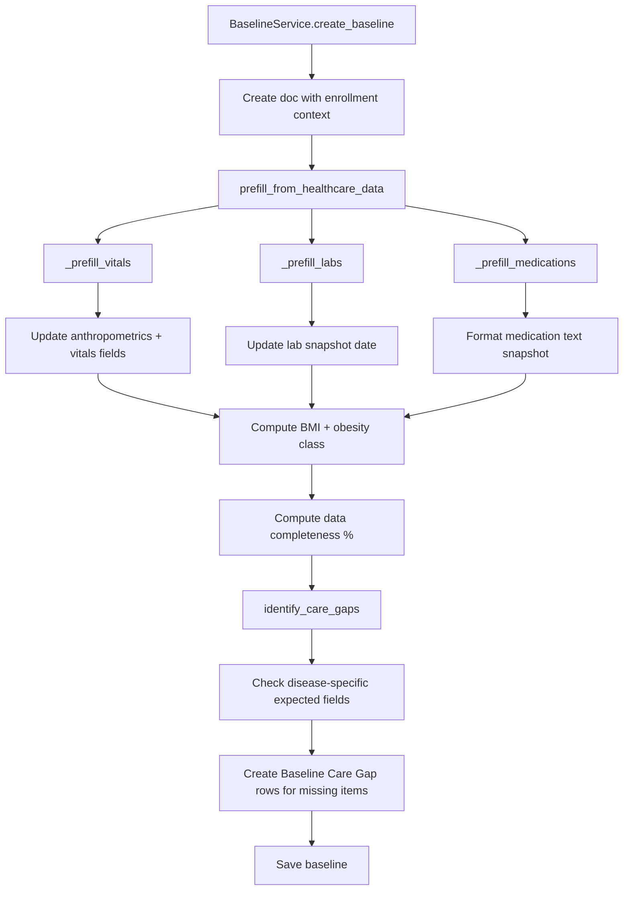

# Baseline Prefill Flow

## Overview

When a Disease Baseline Assessment is created (either from the enrollment form or via API), the `BaselineService` automatically fetches existing healthcare data through the adapter layer and populates baseline fields. It then identifies care gaps for any expected fields that remain empty.

## Adapter Usage

| Adapter | Source DocType | Baseline Fields Populated |
|---|---|---|
| `vitals_adapter.get_latest_vitals` | Vital Signs | height_cm, weight_kg, bp_systolic, bp_diastolic, pulse, vitals_source, vitals_date |
| `lab_adapter.get_latest_lab_result` | Lab Test | labs_source_date (individual lab values require child table parsing) |
| `medication_adapter.get_medication_snapshot` | Medication Request + Drug Prescription | current_medications, medications_source_date |

## Flow Sequence

## Care Gap Logic

Gap definitions are disease-type-specific:

### Diabetes
- Common: BP, weight, height, medications
- Specific: HbA1c, FBS, serum creatinine, eGFR, urine microalbumin, complications assessment

### Obesity
- Common: BP, weight, height, medications
- Specific: Waist circumference, lipid panel (total cholesterol, LDL, HDL, triglycerides), lifestyle readiness

### Combined Metabolic
- All diabetes + all obesity gaps

### Prediabetes / Metabolic Risk
- Common: BP, weight, height, medications
- Specific: FBS, HbA1c, lifestyle readiness

## Refresh vs Initial Prefill

| Aspect | Initial Prefill | Refresh |
|---|---|---|
| Trigger | Automatic on baseline creation | Manual via "Refresh" button |
| Scope | All auto-fetchable fields | Auto-fetchable only (default) or all (overwrite_manual=True) |
| Care gaps | Created fresh | Re-evaluated from scratch |
| Clinician data | Not yet entered | Preserved by default |

## Data Classification

Fields are classified as:

- **Auto-fetchable**: Can be populated from healthcare records (vitals, labs, medications). Defined in `_AUTO_FETCHABLE_FIELDS`.
- **Clinician-curated**: Require manual clinical judgment (diagnosis_type, complications_summary, cardiovascular_risk, renal_risk, lifestyle_readiness). These are never overwritten on refresh unless `overwrite_manual=True`.
