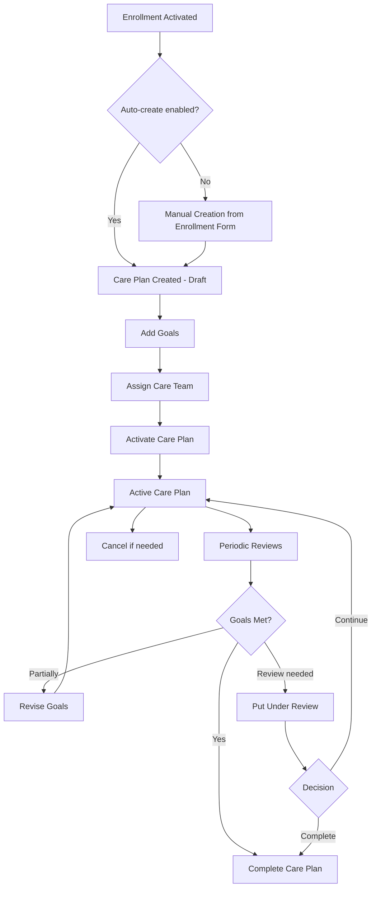

# Care Plan Lifecycle

## Overview

The CDM Care Plan follows a defined lifecycle from creation through completion, with goals managed as linked documents that support revision-based versioning.

## Flow

## Creation

1. A care plan can be created manually from the Disease Enrollment form
2. If `auto_create_care_plan_on_enrollment` is enabled in settings, a plan is created when enrollment becomes Active
3. Only one active/draft plan per enrollment by default (configurable)

## Goal Management

1. Goals are added as linked Disease Goal documents
2. Each goal tracks a specific metric (HbA1c, weight, BMI, etc.) with a target
3. Goals are displayed in the care plan form as an auto-rendered HTML summary
4. When revising a goal:
   - Old goal is marked "Revised"
   - New goal is created with `supersedes` link
   - Version counter increments
   - Full history is preserved

## Review Integration

- Review sheets (Disease Review Sheet) link back to the care plan
- During reviews, clinicians assess goal progress and may revise targets
- The care plan connections section shows linked review sheets

## Status Transitions

| From | To | Trigger |
|---|---|---|
| Draft | Active | Clinician activates after setting goals |
| Draft | Cancelled | Plan no longer needed |
| Active | Under Review | Scheduled review or clinician decision |
| Active | Completed | All goals met or enrollment ending |
| Active | Cancelled | Plan abandoned |
| Under Review | Active | Review complete, continue plan |
| Under Review | Completed | Review concludes plan is done |
| Under Review | Cancelled | Review decides to cancel |

## Data Relationships

- Care Plan → Enrollment (parent)
- Care Plan → Patient (derived from enrollment)
- Care Plan → Healthcare Practitioner (primary)
- Care Plan → Care Team Members (child table)
- Care Plan ← Disease Goals (linked documents)
- Care Plan ← Disease Review Sheets (linked documents)
