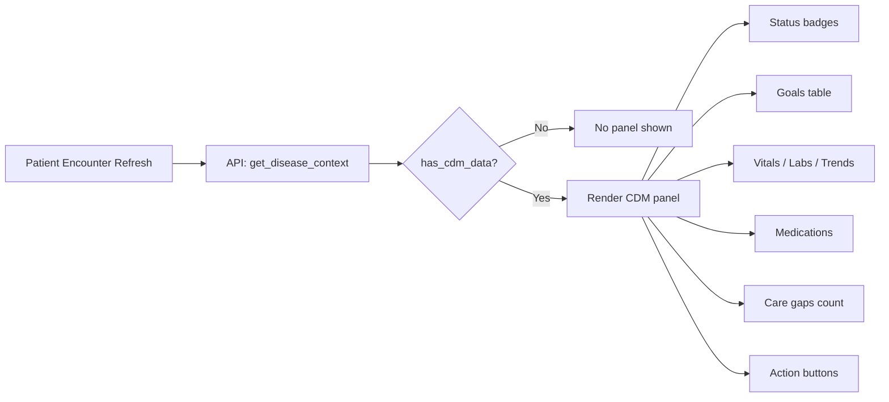

# Encounter Disease Context Panel

## Overview

The encounter disease context panel provides clinicians with at-a-glance chronic disease management data directly within the Patient Encounter form. It eliminates the need to navigate to separate forms to review a patient's CDM status during an OPD visit.

## Design

The panel is rendered as a dashboard section above the encounter content area. It loads data via a single API call on form refresh and only renders when the patient has an active CDM enrollment.

## Data Loading Strategy

All data is assembled server-side in `EncounterContextService.get_disease_context()` and returned in a single API call. This avoids multiple round trips.

### Data sources:

| Data | Source | Method |
|---|---|---|
| Enrollment | Disease Enrollment | `frappe.db.get_value` with status filter |
| Care Plan | CDM Care Plan | `frappe.db.get_value` with enrollment + Active status |
| Goals | Disease Goal | `frappe.get_all` excluding Revised status |
| Recent Vitals | Vital Signs (Healthcare) | `frappe.db.get_value` latest submitted |
| Recent Labs | Lab Test (Healthcare) | `frappe.db.get_value` for HbA1c, FBS templates |
| Medications | Medication Request / Drug Prescription | Via `medication_adapter` |
| Care Gaps | Baseline Care Gap | `frappe.get_all` with Open/In Progress status |
| Trends | Vital Signs + Lab Test | Last 2 values comparison |
| Pending Review | Disease Review Sheet | Check encounter-linked or scheduled |

### Performance considerations:

- **Fast bail-out**: If no active enrollment exists, returns immediately with `{"has_cdm_data": False}`
- **Limited fields**: All queries use `fields` parameter — no full document loads
- **Bounded results**: Medication list capped at 10, goals at 20, care gaps at 10
- **Optional doctype guards**: Uses `doctype_exists()` from adapter layer so missing doctypes degrade gracefully instead of erroring
- **No caching**: Data is always fresh. The overhead is ~5-8 small DB queries, which complete in <50ms on a typical bench setup

## Panel Layout

The panel is organized in a compact, scannable layout:

1. **Status badges** — Enrollment type + status, care plan status, pending review type
2. **Goals summary** — Compact table: metric | target | current | status with color-coded status
3. **Recent data row** — Three columns: vitals (weight, BMI, BP), labs (HbA1c, FBS), trends (weight/HbA1c arrows)
4. **Active medications** — Comma-separated list
5. **Care gaps** — Count of open gaps
6. **Action buttons** — Open Care Plan, Open/Create Review, Open Enrollment

## Action Buttons

| Button | Behavior |
|---|---|
| Open Care Plan | Navigates to the active CDM Care Plan form |
| Open Review | If pending review exists, navigates to it |
| Create Review | If no pending review, creates one via `create_review_from_encounter` API |
| Open Enrollment | Navigates to the active Disease Enrollment form |

## Graceful Degradation

If certain data is unavailable:
- Missing Vital Signs doctype → vitals section not shown
- Missing Lab Test doctype → labs section not shown
- No care plan → goals section not shown
- No care gaps → care gaps line not shown
- No pending review → "Create Review" button instead of "Open Review"

The panel never errors — it simply shows whatever data is available.
