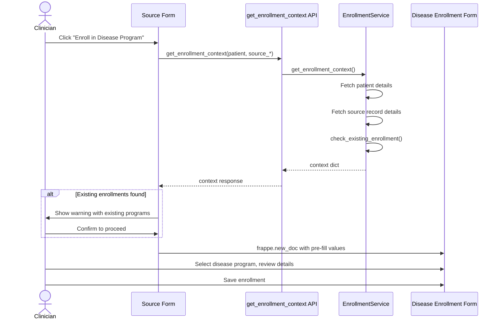

# Enrollment from OPD Flow

## Overview

Clinicians can initiate disease management enrollment directly from three OPD-related records without navigating away from their current workflow. The system preserves the clinical context (source record, practitioner) and warns about existing enrollments.

## Trigger Points

| Source DocType | Button Location | Pre-filled Fields |
|---|---|---|
| Patient | Form toolbar > CDM group | patient, patient_name, patient_sex, patient_age |
| Patient Encounter | Form toolbar > CDM group | patient, patient details, practitioner, source_encounter |
| Patient Appointment | Form toolbar > CDM group | patient, patient details, practitioner, source_appointment |

## Sequence Diagram

## Source Linkage Behavior

When enrollment is initiated from a specific OPD record, the source is preserved:

- **From Patient Encounter**: `source_encounter` field stores the encounter ID. The practitioner from the encounter is pre-filled.
- **From Patient Appointment**: `source_appointment` field stores the appointment ID. The practitioner from the appointment is pre-filled.
- **From Patient**: No source link is stored. Practitioner must be selected manually.

If both encounter and appointment are somehow provided, the encounter's practitioner takes priority.

## Duplicate Handling

Before opening the enrollment form, the system calls `check_existing_enrollment` which returns all non-terminal (Draft, Active, On Hold) enrollments for the patient. If any exist:

1. A confirmation dialog lists them with disease type, status, and ID
2. The clinician must explicitly confirm to proceed
3. The duplicate prevention logic in `DiseaseEnrollment.before_insert` still applies as a server-side safety net

## Client Scripts

| File | DocType | Hook |
|---|---|---|
| `public/js/patient.js` | Patient | `doctype_js` |
| `public/js/patient_encounter.js` | Patient Encounter | `doctype_js` |
| `public/js/patient_appointment.js` | Patient Appointment | `doctype_js` |

These are registered in `hooks.py` under the `doctype_js` key.

## API Endpoints Used

| Endpoint | Purpose |
|---|---|
| `chronic_disease_management.api.enrollment.get_enrollment_context` | Build pre-fill context |
| `chronic_disease_management.api.enrollment.check_existing_enrollment` | Duplicate check |
