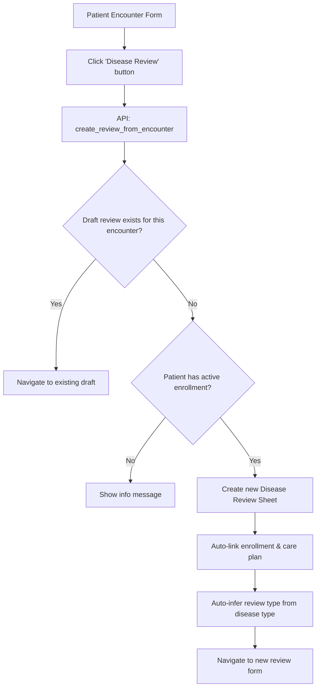

# Review from Encounter Flow

## Overview

Clinicians can launch a Disease Review Sheet directly from within a Patient Encounter. This supports the OPD workflow where chronic disease reviews happen during regular appointments.

## Flow

## Button Behavior

1. The "Disease Review" button appears in the CDM button group on every Patient Encounter (for non-new encounters with a patient set)
2. Clicking calls `create_review_from_encounter` API
3. The API checks for existing drafts before creating duplicates
4. On success, navigates to the Disease Review Sheet form

## Auto-link Logic

When creating a review from an encounter:
1. Patient is taken from the encounter
2. Practitioner is taken from the encounter
3. Active enrollment is found by querying `Disease Enrollment` for the patient
4. Active care plan is found by querying `CDM Care Plan` for the enrollment
5. Review type is inferred from the enrollment's disease type:
   - Diabetes → "Diabetes Follow-up"
   - Obesity → "Obesity Follow-up"
   - Combined Metabolic → "Combined Metabolic Follow-up"
   - Default → "New Evaluation"

## Partial Save Support

The review sheet is created in "Draft" status, allowing clinicians to:
- Fill in sections as the consultation progresses
- Save partially and return later
- Change status to "In Progress" when actively reviewing
- Complete when all sections are addressed

## Duplicate Prevention

The API checks for existing `Draft` reviews linked to the same encounter before creating a new one. If found, it returns the existing draft's name for navigation.
